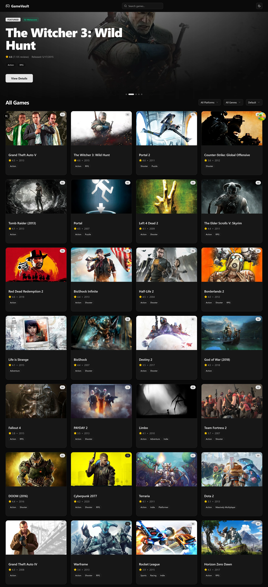
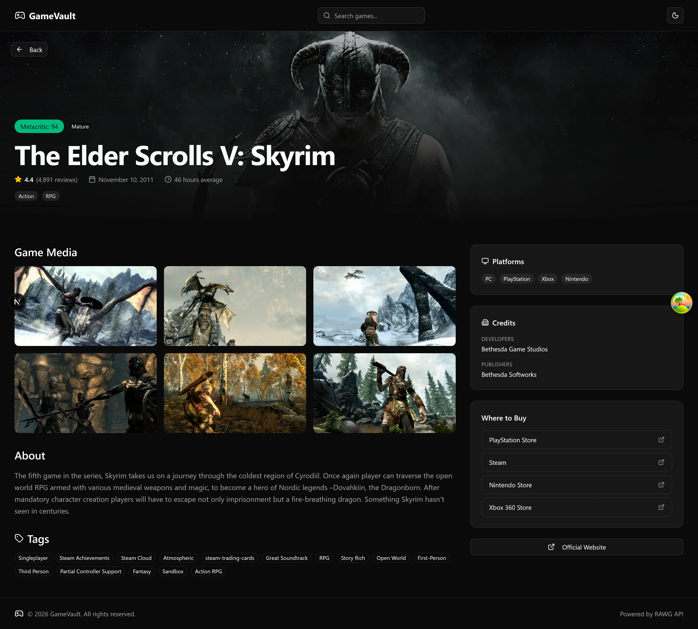
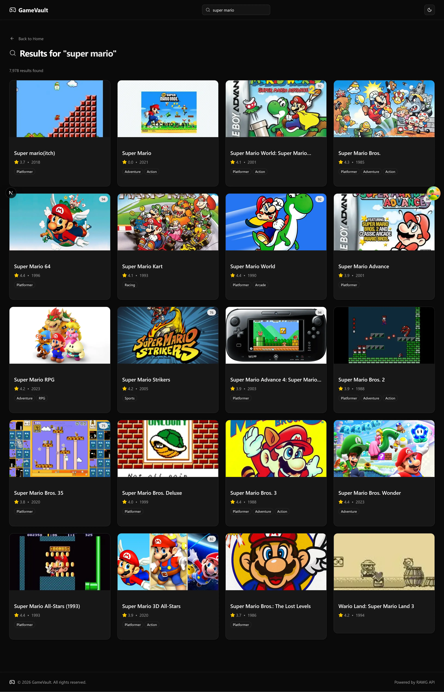
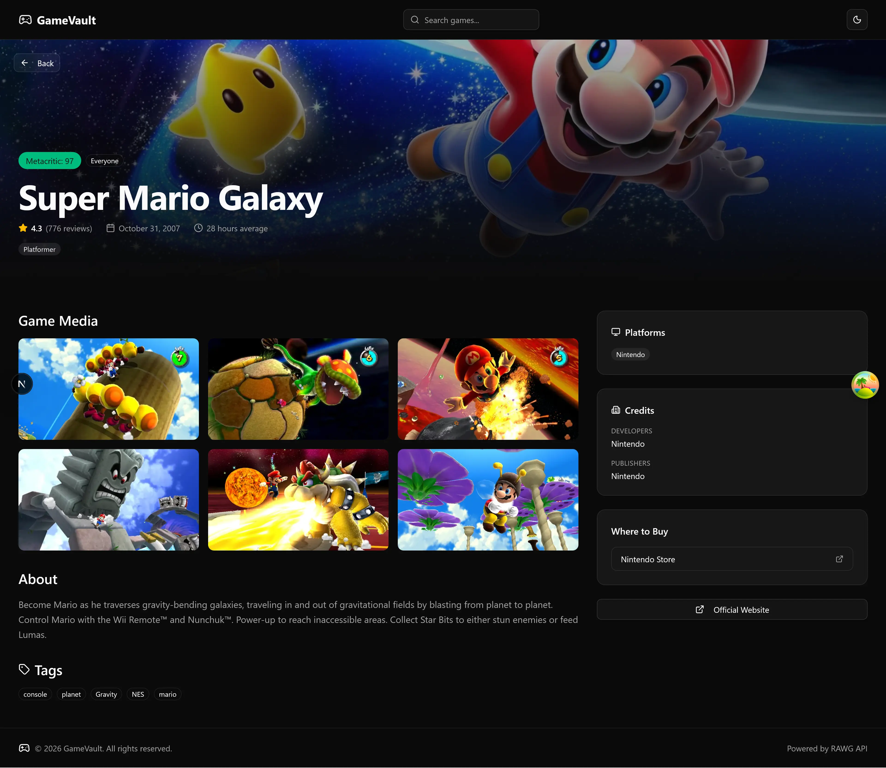

# 🎮 GameVault

**GameVault** is a modern, responsive video game discovery platform built with **Next.js (App Router)** and the **RAWG API**. It allows users to browse, search, and filter a massive catalog of games with fast performance, SEO-friendly rendering, and a polished UI.

This project was built to demonstrate best practices in **server-side rendering, client-side data fetching, URL-driven state management, and scalable frontend architecture**.






## ✨ Key Features

- **Server-Side Rendering (SSR)**
  Initial game data is fetched on the server and hydrated into TanStack Query for fast first paint, improved SEO, and smooth client-side transitions.

- **Infinite Scrolling**
  Games load progressively using `useInfiniteQuery` and the Intersection Observer API for an uninterrupted browsing experience.

- **URL-Driven State Management**
  Search, filters, and sorting are persisted in URL search parameters, enabling shareable, bookmarkable views without global state libraries.

- **Detailed Game Pages**
  Individual game pages include screenshots, metadata, ratings, platform information, and dynamically generated Open Graph metadata.

- **Secure API Layer**
  RAWG API requests are handled in server components or proxied through Next.js Route Handlers to keep API keys securely on the server.

## 🛠️ Tech Stack

- Next.js 16 + React 19
- TypeScript
- Tailwind CSS for styling
- shadcn/ui components for beautiful, accessible design
- TanStack Query for smooth data fetching & caching
- RAWG API Video Games Database

## 🚀 Getting Started

### Prerequisites

- Node.js 18+
- A free RAWG API key from [rawg.io/apidocs](https://rawg.io/apidocs)

### Environment Variables

Create a `.env` file:

```
RAWG_API_KEY=your_rawg_api_key
```

### Installation & Development

```bash
npm install
npx shadcn@latest init
npm run dev
```

Then open [http://localhost:3000](http://localhost:3000) in your browser.

## 🧠 What I Learned

Building GameVault helped me deepen my understanding of how modern Next.js applications are structured and optimized for performance, scalability, and user experience.

- **Effective Server/Client Data Boundaries**
  I learned how to combine server-side data fetching with TanStack Query hydration to achieve fast initial loads while still benefiting from powerful client-side caching and pagination.

- **URL-Based State as a Scalable Pattern**
  Managing filters and search state via URL search parameters eliminated the need for global state libraries and made the app easier to reason about, debug, and share.

- **Infinite Queries at Scale**
  Implementing `useInfiniteQuery` with Intersection Observer taught me how to handle pagination, caching, and loading states cleanly without sacrificing UX.

- **Secure API Design in Next.js**
  Proxying client-side RAWG API requests through Route Handlers reinforced best practices around keeping secrets server-side and designing a clean internal API layer.

- **SEO & Metadata in the App Router**
  Creating dynamic metadata for game detail pages improved my understanding of how SEO, Open Graph tags, and server-rendered routes work together in Next.js.

## 📄 License

MIT
